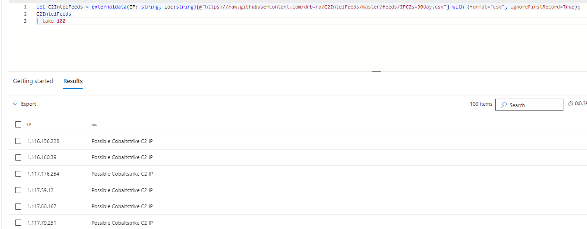

# Free Threat Intel/IOC Feeds [](https://twitter.com/intent/tweet?text=Open%20Source%20Threat%20Intel%20Feeds%20Listed!%20Compatible%20with%20EDR%20and%20SIEM%20Solutions!&url=https://github.com/Bert-JanP/Hunting-Queries-Detection-Rules)
This repository contains Open Source freely usable Threat Intel feeds that can be used without additional requirements. The CSV [ThreatIntelFeeds](./ThreatIntelFeeds.csv) is stored in a structured manner based on the Vendor, Description, Category and URL. The vendors offering ThreatIntelFeeds are described below. 
The following feed categories are available:
- SSL
- IP
- DNS
- URL
- MD5
- SHA1
- SHA256
- CVEID

The content is served as is. When using the content in a business environment the conditions have to be researched before using the content, it might be that some content cannot be used freely under certain conditions. It is your own responsibility to research if that is the case or not.

| Category | Count |
| --- | --- |
| DNS | 13 |
| IP | 66 |
| MD5 | 10 |
| SHA1 | 3 |
| SHA256 | 7 |
| SSL | 1 |
| URL | 22 |
| CVEID | 4 |


# Combine Threat Intel in your EDR and SIEM
The feeds available in this repository can be used to perform threat hunting in your EDR or SIEM solution to hunt for malicious activity. For Defender For Endpoint and Sentinel, some KQL hunting rules have already been written to be implemented in your EDR or SIEM. See: [KQL Hunting Queries](https://github.com/Bert-JanP/Hunting-Queries-Detection-Rules/tree/main/Threat%20Hunting)

## KQL
You can easily implement the open-source feeds in KQL for M365D Advanced Hunting or Sentinel. This is done by using the [externaldata](https://learn.microsoft.com/en-us/azure/data-explorer/kusto/query/externaldata-operator?pivots=azuredataexplorer) operator. This operator can take an external link as input and parse the result to a data table that can be used to join or to filter based on your other tables. An example is shown below and the output is a table just like any other.

```
let C2IntelFeeds = externaldata(IP: string, ioc:string)[@"https://raw.githubusercontent.com/drb-ra/C2IntelFeeds/master/feeds/IPC2s-30day.csv"] with (format="csv", ignoreFirstRecord=True);
C2IntelFeeds
| take 100
```


The documentation explains the different parameters that are used, such as if you want to ignore the first row or not.

### Combining EDR Network Traffic and IOC Feeds
The results of combining the EDR Network Traffic and the IOC feed is shown below. This detection can help you identify devices that connect to IPs that host command and control servers.
```
let C2IntelFeeds = externaldata(IP: string, ioc:string)[@"https://raw.githubusercontent.com/drb-ra/C2IntelFeeds/master/feeds/IPC2s-30day.csv"] with (format="csv", ignoreFirstRecord=True);
let IPList = C2IntelFeeds
| project IP;
DeviceNetworkEvents
| where RemoteIP in (IPList)
| join C2IntelFeeds on $left.RemoteIP == $right.IP
| extend GeoIPInfo = geo_info_from_ip_address(RemoteIP)
| extend country = tostring(parse_json(GeoIPInfo).country), state = tostring(parse_json(GeoIPInfo).state), city = tostring(parse_json(GeoIPInfo).city), latitude = tostring(parse_json(GeoIPInfo).latitude), longitude = tostring(parse_json(GeoIPInfo).longitude)
| project Timestamp, DeviceName, RemoteIP, RemotePort, RemoteUrl, ioc
```

# Contributions 
Contributions are much appreciated to make this list with free Threat Intel/IOC feeds as big and as up-to-date as possible. You can contribute by creating a pull request. This PR must contain the following content:
1. Add the link to the feed in the README.md file. If there is not a section yet in which the source fits, create a new section.
2. Add the details to the ThreatIntelFeeds.csv file, the format which is used is shown below. The Category refers to the feed categories shown above.
    ```
    Vendor;Description;Category;Url
    ```
3. The source must be free and usable without any account or API token needed. 
4. Use the [Validator.py](./Scripts/Validator.py) script to validate the content of the CSV file. This can be done by running it in the *script* directory.
5. Update the IOC Feed Statistics table by running the [GenerateTableStatistics.py](./Scripts/GenerateTableStatistics.py) which will save the markdown table in the *StatisticsTable.md* file. This table can then be pasted above. 


# Abuse.ch
- https://sslbl.abuse.ch/blacklist/sslblacklist.csv
- https://sslbl.abuse.ch/blacklist/sslipblacklist.csv
- https://sslbl.abuse.ch/blacklist/sslipblacklist.txt
- https://sslbl.abuse.ch/blacklist/sslipblacklist_aggressive.csv
- https://sslbl.abuse.ch/blacklist/sslipblacklist_aggressive.txt
- https://threatfox.abuse.ch/downloads/hostfile/
- https://feodotracker.abuse.ch/downloads/ipblocklist.txt
- https://feodotracker.abuse.ch/blocklist/
- https://bazaar.abuse.ch/export/txt/md5/recent/
- https://threatfox.abuse.ch/export/csv/md5/recent/
- https://bazaar.abuse.ch/export/txt/sha1/recent/
- https://bazaar.abuse.ch/export/txt/sha256/recent/
- https://threatfox.abuse.ch/export/csv/sha256/recent/
- https://urlhaus.abuse.ch/downloads/csv_recent/

Terms of Service: https://sslbl.abuse.ch/blacklist/, https://feodotracker.abuse.ch/blocklist/

# Blocklist.de
- https://lists.blocklist.de/lists/all.txt
- https://lists.blocklist.de/lists/ssh.txt
- https://lists.blocklist.de/lists/mail.txt
- https://lists.blocklist.de/lists/apache.txt
- https://lists.blocklist.de/lists/imap.txt
- https://lists.blocklist.de/lists/bots.txt
- https://lists.blocklist.de/lists/bruteforcelogin.txt
- https://lists.blocklist.de/lists/strongips.txt

Terms of Service: https://www.blocklist.de/en/index.html

# IPSum
- https://raw.githubusercontent.com/stamparm/ipsum/master/levels/1.txt
- https://raw.githubusercontent.com/stamparm/ipsum/master/levels/2.txt
- https://raw.githubusercontent.com/stamparm/ipsum/master/levels/3.txt
- https://raw.githubusercontent.com/stamparm/ipsum/master/levels/4.txt
- https://raw.githubusercontent.com/stamparm/ipsum/master/levels/5.txt
- https://raw.githubusercontent.com/stamparm/ipsum/master/levels/6.txt
- https://raw.githubusercontent.com/stamparm/ipsum/master/levels/7.txt
- https://raw.githubusercontent.com/stamparm/ipsum/master/levels/8.txt

# C2IntelFeeds
- https://github.com/drb-ra/C2IntelFeeds/blob/master/feeds/IPC2s-30day.csv
- https://github.com/drb-ra/C2IntelFeeds/blob/master/feeds/domainC2s-30day-filter-abused.csv
- https://github.com/drb-ra/C2IntelFeeds/blob/master/feeds/domainC2swithURL-30day-filter-abused.csv
- https://github.com/drb-ra/C2IntelFeeds/blob/master/feeds/domainC2swithURL-filter-abused.csv
- https://github.com/drb-ra/C2IntelFeeds/blob/master/feeds/domainC2swithURLwithIP-30day-filter-abused.csv
- https://github.com/drb-ra/C2IntelFeeds/blob/master/feeds/domainC2s.csv
- https://github.com/drb-ra/C2IntelFeeds/blob/master/feeds/unverified/IPC2s.csv

# Montysecurity Feeds
- https://github.com/montysecurity/C2-Tracker/blob/main/data/Brute%20Ratel%20C4%20IPs.txt
- https://github.com/montysecurity/C2-Tracker/blob/main/data/Cobalt%20Strike%20C2%20IPs.txt
- https://github.com/montysecurity/C2-Tracker/blob/main/data/Posh%20C2%20IPs.txt
- https://github.com/montysecurity/C2-Tracker/blob/main/data/Sliver%20C2%20IPs.txt
- https://github.com/montysecurity/C2-Tracker/blob/main/data/Metasploit%20Framework%20C2%20IPs.txt
- https://github.com/montysecurity/C2-Tracker/blob/main/data/Havoc%20C2%20IPs.txt
- https://raw.githubusercontent.com/montysecurity/C2-Tracker/main/data/BurpSuite%20IPs.txt
- https://raw.githubusercontent.com/montysecurity/C2-Tracker/main/data/Deimos%20C2%20IPs.txt
- https://raw.githubusercontent.com/montysecurity/C2-Tracker/main/data/GoPhish%20IPs.txt
- https://raw.githubusercontent.com/montysecurity/C2-Tracker/main/data/Gotham%20Stealer%20IPs.txt
- https://raw.githubusercontent.com/montysecurity/C2-Tracker/main/data/Hachcat%20Cracking%20Tool%20IPs.txt
- https://raw.githubusercontent.com/montysecurity/C2-Tracker/main/data/Metasploit%20Framework%20C2%20IPs.txt
- https://raw.githubusercontent.com/montysecurity/C2-Tracker/main/data/Mythic%20C2%20IPs.txt
- https://raw.githubusercontent.com/montysecurity/C2-Tracker/main/data/NimPlant%20C2%20IPs.txt
- https://raw.githubusercontent.com/montysecurity/C2-Tracker/main/data/PANDA%20C2%20IPs.txt
- https://raw.githubusercontent.com/montysecurity/C2-Tracker/main/data/Posh%20C2%20IPs.txt
- https://raw.githubusercontent.com/montysecurity/C2-Tracker/main/data/PowerSploit%20IPs.txt
- https://raw.githubusercontent.com/montysecurity/C2-Tracker/main/data/XMRig%20Monero%20Cryptominer%20IPs.txt
- https://raw.githubusercontent.com/montysecurity/C2-Tracker/main/data/all.txt


# Carbon Black
- https://github.com/carbonblack/active_c2_ioc_public/blob/main/cobaltstrike/actor-specific/cobaltstrike_luckymouse_ta428.csv
- https://github.com/carbonblack/active_c2_ioc_public/blob/main/cobaltstrike/actor-specific/cobaltstrike_pyxie.csv
- https://github.com/carbonblack/active_c2_ioc_public/blob/main/shadowpad/shadowpad_202209.tsv

# tweetfeed.live
- https://tweetfeed.live/
- https://raw.githubusercontent.com/0xDanielLopez/TweetFeed/master/today.csv
- https://raw.githubusercontent.com/0xDanielLopez/TweetFeed/master/week.csv
- https://raw.githubusercontent.com/0xDanielLopez/TweetFeed/master/month.csv
- https://raw.githubusercontent.com/0xDanielLopez/TweetFeed/master/year.csv

# Botvrij
- https://www.botvrij.eu/data/blocklist/blocklist_domain.csv
- https://www.botvrij.eu/data/ioclist.md5
- https://www.botvrij.eu/data/ioclist.sha1
- https://www.botvrij.eu/data/ioclist.sha256

# Proofpoint
- https://rules.emergingthreats.net/blockrules/compromised-ips.txt

# CINSscore
- https://cinsscore.com/list/ci-badguys.txt

# Phishing Army
- https://phishing.army/download/phishing_army_blocklist.txt
- https://phishing.army/download/phishing_army_blocklist_extended.txt

# Alienvault
- http://reputation.alienvault.com/reputation.data
- https://reputation.alienvault.com/reputation.generic

# Cisco Talos
- http://www.talosintelligence.com/documents/ip-blacklist

# Binarydefense
- https://www.binarydefense.com/banlist.txt

# CISA
- https://www.cisa.gov/sites/default/files/csv/known_exploited_vulnerabilities.csv - CSV
- https://www.cisa.gov/sites/default/files/feeds/known_exploited_vulnerabilities.json - JSON

# eCrimeLabs 
- https://feeds.ecrimelabs.net/data/metasploit-cve

# MISP Feed CERT-FR
- https://misp.cert.ssi.gouv.fr/feed-misp/hashes.csv

# Mr. Looquer IOC Feed
- https://iocfeed.mrlooquer.com/feed.csv

# SNORT
- https://snort.org/downloads/ip-block-list

# ELLIO: IP Feed (Community version)
- https://cdn.ellio.tech/community-feed

Terms of Service: https://ellio.tech/beta-terms-and-conditions

# CyberCure
- https://api.cybercure.ai/feed/get_hash?type=csv
- https://api.cybercure.ai/feed/get_url?type=csv
- https://api.cybercure.ai/feed/get_ips?type=csv

# DigitalSide Threat-Intel
- https://osint.digitalside.it/Threat-Intel/lists/latesturls.txt
- https://osint.digitalside.it/Threat-Intel/lists/latestips.txt
- https://osint.digitalside.it/Threat-Intel/lists/latestdomains.txt

# OpenPhish
- https://openphish.com/feed.txt

# PhishTank
- http://data.phishtank.com/data/online-valid.json

# Cert.PL
- https://hole.cert.pl/domains/domains.csv

# GreenSnow
- https://blocklist.greensnow.co/greensnow.txt

# Mirai Security
- https://mirai.security.gives/data/ip_list.txt

# NIST
- https://services.nvd.nist.gov/rest/json/cves/2.0

# Other Github based feeds
- https://raw.githubusercontent.com/aptnotes/data/master/APTnotes.csv
- https://raw.githubusercontent.com/fox-it/cobaltstrike-extraneous-space/master/cobaltstrike-servers.csv
- https://raw.githubusercontent.com/ktsaou/blocklist-ipsets/master/firehol_level1.netset
- https://github.com/ThreatMon/ThreatMon-Daily-C2-Feeds
  
# Url Abuse
- https://urlabuse.com/public/data/data.txt
- Latest 500 entries of DB in CSV format - https://urlabuse.com/public/data/data_csv.txt
- https://urlabuse.com/public/data/data.json
- https://urlabuse.com/public/data/malware_url.txt
- https://urlabuse.com/public/data/phishing_url.txt
- https://urlabuse.com/public/data/hacked_url.txt
- https://urlabuse.com/public/data/dumps
- https://urlabuse.com/public/files
- https://urlabuse.com/public/screenshot
- https://urlabuse.com/public/misp

# virtualfabric
- https://nocdn.nrd-list.com/0/nrd-list-32-days.txt
- https://nocdn.threat-list.com/0/domains.txt
- https://dl.threat-list.com/1/domains.txt
  
# Notable links
- https://github.com/eset/malware-ioc
- https://www.misp-project.org/feeds/
- https://github.com/MISP/MISP/blob/2.4/app/files/feed-metadata/defaults.json
- https://github.com/executemalware/Malware-IOCs
- https://raw.githubusercontent.com/tsirolnik/spam-domains-list/master/spamdomains.txt

# Sources with multiple feeds depending on threat
- https://github.com/firehol/blocklist-ipsets
- https://github.com/pan-unit42/iocs
